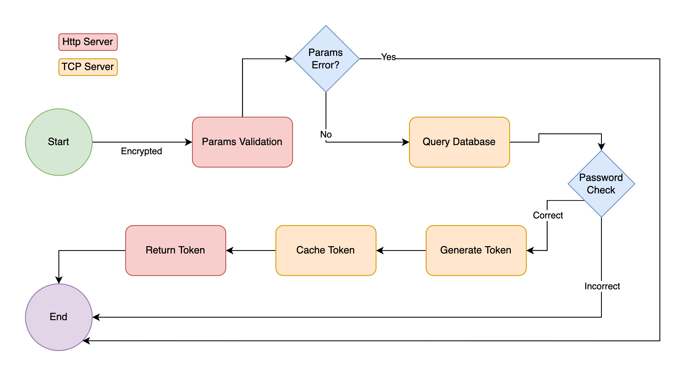

# Entry Task

<p align="center">
  
  
  
  
  
  
</p>

## TL;DR

```text
A web application implemented by Go, supports login, changing user profile, Use standard library whenever possible.
```

## Structure

```tree
.
├── README.md
├── assets          avatars
├── client          http server
├── go.mod
├── go.sum
├── main.go         main
├── pb              protobuf
├── rpc             tcp request
├── scripts         scripts
├── server          tcp server
└── web             frontend
```

## Setup

>MySQL and Reids

```text
MySQL and Redis are required for the project, before running the project, make sure they are running.

Search for 3306 and 6379 to change the credentials and configs.
```

>Fake data

```text
change MySQL configs in /scripts/fake.py respectively.
```

## Usage

>GO

```go
go mod tidy
go run main.go
```

>Web

```bash
cd web
npm install
npm run dev
```

>Benchmark

```json
brew install k6
k6 run scripts/login.js --duration 30s --vus 1000 --rps 6000
```

## Logic Flow

**all params are required for requests below**

### login



> Request Example

```bash
curl --location --request POST '127.0.0.1:8080/login' \
--header 'Content-Type: application/json' \
--data-raw '{
    "username":"test1",
    "password":"test"  
}'
```

>Return Example

```json
{
    "code": 0,
    "data": {
        "token": "699679f38595e51ed155a181f3270c85"
    },
    "msg": "ok"
}
```

### user profile


> Request Example

```bash
curl --location --request POST '127.0.0.1:8080/profile' \
--header 'Content-Type: application/json' \
--data-raw '{
    "username": "test1", 
    "token":"7e61b2220b1936d6e27cd7fa07057fdb" 
}'
```

>Return Example

```json
{
    "code": 0,
    "data": {
        "nickname": "few",
        "pic": "http://localhost:8080/assets/test1.jpeg",
        "username": "test1"
    },
    "msg": "ok"
}
```

### change nickname


>Request Example

```bash
curl --location --request POST '127.0.0.1:8080/nickname' \
--header 'Content-Type: application/json' \
--data-raw '{
    "nickname": "qwewq",                         
    "token": "7e61b2220b1936d6e27cd7fa07057fdb", 
    "username": "test1"                          
}'
```

>Return Example

```bash
{
    "code": 0,
    "data": {
        "nickname": "few",
        "pic": "http://localhost:8080/assets/test1.jpeg",
        "username": "test1"
    },
    "msg": "ok"
}
```

### change avatar

> same as previous one

### register

>Request Example

```bash
curl --location --request POST '127.0.0.1:8080/register' \
--header 'Content-Type: application/x-www-form-urlencoded' \
--data-urlencode 'username=weizsw' \
--data-urlencode 'password=weizsw'
```

>Return Example

```bash
{
    "code": 0,
    "data": "ok",
    "msg": "ok"
}
```

## Database Design

```sql
CREATE TABLE users (
 id int NOT NULL AUTO_INCREMENT,
 username varchar(20) NOT NULL,
 nickname varchar(20) NOT NULL default '',
 password varchar(200) NOT NULL,
 profile_pic varchar(200),
 PRIMARY KEY (id),
 UNIQUE KEY `index_username` (`username`)
);
```

## Redis Design

> for a token, hash was used, tokens are saved as "user:token:{username}" as the key, each token takes a field and value is 1.

> the others are just normal string.

## Password Enncryption

> Bcrypt was used initially, but for performance issues, each Bcrypt hash took around 200-300ms, therefore, a regular md5 hash is used eventually.

## Simple Connection Pool

```go
type Pool struct {
 m        sync.Mutex
 resource chan net.Conn
 maxSize  int
 usedSize int
 factory  func() (net.Conn, error)
 closed   bool
}
```

>channel was used for the connection pool, there will 2000 connections established with TCP server once the client is initiated, each request sent by HTTP server will acquire a connection from the pool, if there are no connections left in the pool and the max size is not reached, the factory will produce a new connection.

>once the request is finished, the connection will be released to the pool for future use. basically, there are 2000 connections maintained.

## Benchmark

- [x] Supports 1000 concurrent http requests

>Without cache layer

- [x] supports 3000 login requests per second
- [x] from at least 200 unique users
- [x] no socket/timeout error

>With cache layer

- [x] supports 6000 login requests per second
- [x] from at least 200 unique users
- [x] no socket/timeout error


```text
Since the RPS without a cache layer is almost reached the requirement with a cache layer, thus, the cache layer is not implemented.
```
